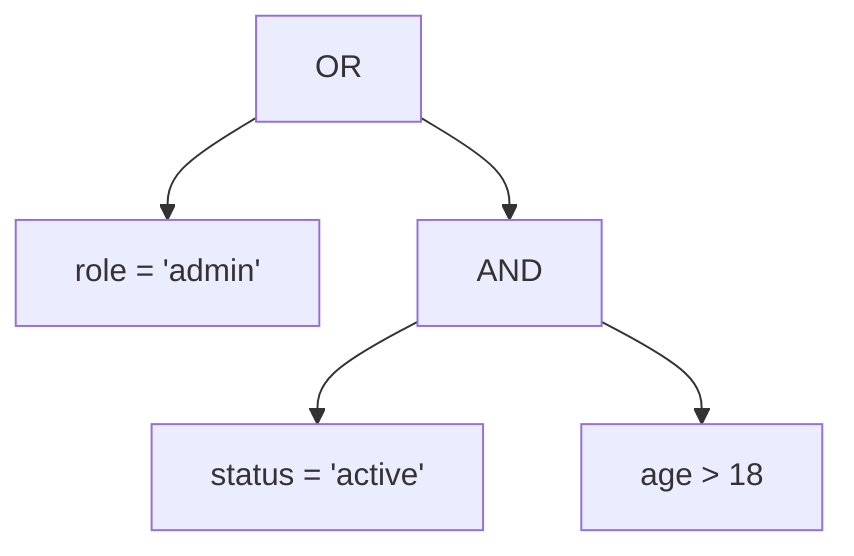

# How we let users write filter expressions in a URL -- and turned them into real database queries

We needed to support filter expressions like this in API query parameters:

```
GET /staff?filter=role='admin' OR (status='active' AND department='engineering')
```

And turn them into safe, validated SQL WHERE clauses. The obvious first instinct was string manipulation: split on `OR`, split on `AND`, regex out the field names and values. That path leads to bugs, injection vulnerabilities, and an unmaintainable mess within a week.

Instead, we built a small three-stage pipeline: **tokenize** the string into meaningful chunks, **parse** those chunks into a tree, then walk the tree to build the query. This is the same approach every programming language uses to understand source code, just scaled way down.

## The three stages, by analogy

Reading a sentence in English works the same way:

```
"The cat sat on the mat"

Stage 1 - Words:    [The] [cat] [sat] [on] [the] [mat]
Stage 2 - Grammar:  Subject(The cat) + Verb(sat) + Prepositional phrase(on the mat)
Stage 3 - Meaning:  A cat is sitting on a mat
```

Our filter pipeline:

```
"role='admin' OR status='active'"

Stage 1 - Tokens:   [IDENT:role] [OP:=] [VALUE:'admin'] [OR] [IDENT:status] [OP:=] [VALUE:'active']
Stage 2 - Tree:     OR( condition(role = 'admin'), condition(status = 'active') )
Stage 3 - SQL:      WHERE root.role = :p0 OR root.status = :p1
```

## Stage 1: Tokenization (the lexer)

The lexer walks through the input string character by character and produces a flat list of tokens. Each token has a type and a value.

Input: `role='admin' OR status='active'`

```
Token Stream:
+----------+-----------+
|   Type   |   Value   |
+----------+-----------+
| IDENT    | role      |
| OP       | =         |
| VALUE    | admin     |
| OR       | OR        |
| IDENT    | status    |
| OP       | =         |
| VALUE    | active    |
| EOF      |           |
+----------+-----------+
```

The lexer recognizes field names (`IDENT`), operators (`=`, `!=`, `>`, `<`, `LIKE`, `ILIKE`, `IS NULL`, `IN`), quoted string values, numbers, boolean literals, `AND`, `OR`, parentheses, and commas.

This is just categorization. No logic about what the expression means yet.

## Stage 2: Parsing into a tree

The parser reads the token stream and builds a tree structure. This tree is what lets us safely inspect and transform the filter before it ever touches the database.

For `role='admin' OR (status='active' AND age>18)`:



Each node is either a **logical node** (AND or OR, with children) or a **condition node** (a field, operator, and value). The code calls these `LogicalNode` and `ConditionNode`.

The parser uses **recursive descent** with three levels that match operator precedence:

```
parseExpression()    <-- handles OR  (lowest precedence)
    |
    +-- parseTerm()  <-- handles AND
          |
          +-- parseFactor()  <-- handles parentheses or single conditions
                |
                +-- parseCondition()  <-- reads IDENT OP VALUE
```

`OR` binds the loosest, so `A AND B OR C` means `(A AND B) OR C`, not `A AND (B OR C)`. Parentheses override this, just like in math.

## The bracket filter alternative

Not every client wants to write a string expression. We also support a structured bracket syntax in query params:

```
GET /staff?filter[status][eq]=active&filter[age][gte]=18
```

This arrives as a nested object:

```json
{ "status": { "eq": "active" }, "age": { "gte": "18" } }
```

The `parseBracketFilter()` function converts this directly into the same tree shape:

```typescript
// Input:  { status: { eq: 'active' }, age: { gte: '18' } }
// Output: AND( condition(status eq 'active'), condition(age gte 18) )
```

Both paths, string expression and bracket syntax, produce the same tree type. The rest of the pipeline does not care which format the request used.

## Merging both formats

A client can even use both in one request. The `mergeAsts()` function combines the two trees under a single AND node:

```typescript
export function mergeAsts(dslAst, bracketAst) {
  return { type: ASTNodeType.AND, children: [dslAst, bracketAst] };
}
```

```
String filter: role='admin'        Bracket filter: status=active
      |                                  |
      v                                  v
  ConditionNode                    ConditionNode
  (role = 'admin')                 (status = 'active')
      |                                  |
      +------ mergeAsts() --------+
                    |
                    v
              LogicalNode(AND)
              /            \
   role = 'admin'    status = 'active'
```

## Why a tree instead of string manipulation

It would have been fewer lines of code to regex the filter string and interpolate values into SQL. Here is why we did not:

| String manipulation | Tree (our approach) |
|---|---|
| Easy to accidentally allow SQL injection | Values are always parameterized |
| Hard to validate which fields are used | Walk the tree, collect all field names in a Set |
| Cannot optimize before execution | Reorder conditions, detect join-only filters, push down predicates |
| Cannot support two input formats | Both formats produce the same tree |
| Debugging = staring at string concatenation | Debugging = printing a tree structure |

The tree is the single source of truth for the entire query pipeline. The validator walks it to check field whitelists. The join planner walks it to figure out which tables need joining. The optimizer walks it to reorder conditions. The SQL builder walks it to produce the final WHERE clause.

One parse, many consumers. That is the payoff for the upfront work of building a lexer and parser.

## What the tree looks like in code

```typescript
// Condition node
{
  type: 'CONDITION',
  field: 'status',
  operator: 'eq',
  value: 'active'
}

// Logical node
{
  type: 'OR',
  children: [
    { type: 'CONDITION', field: 'role', operator: 'eq', value: 'admin' },
    { type: 'CONDITION', field: 'status', operator: 'eq', value: 'active' }
  ]
}
```

That structure is simple enough to serialize, log, cache, and test. Each downstream component takes it as input and either transforms it into a new tree or reads from it to produce output. No magic, no hidden state. Just data flowing through functions.
