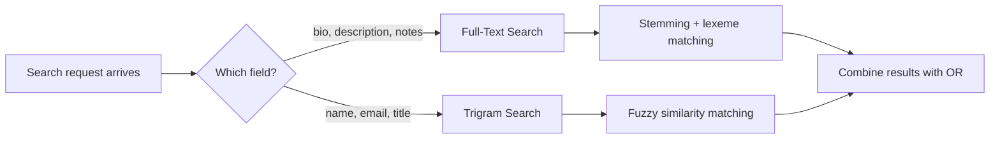

# PostgreSQL has two ways to search text. Here's when to use each -- and how to use both at once.

PostgreSQL ships with two built-in approaches to text search, and they solve different problems. Picking the wrong one means your search either misses obvious results or returns irrelevant noise. We use both in the same query engine, configured per field, because no single approach handles every kind of text.

## The two approaches, side by side

**Full-text search** breaks text into normalized words (lexemes), handles stemming (so "running" matches "run"), and works well on long-form text like bios, descriptions, or article bodies.

**Trigram search** splits text into overlapping groups of three characters and compares how many groups two strings share. It handles typos and partial matches, and works well on short text like names and titles.

| | Full-text search | Trigram search |
|---|---|---|
| How it works | Breaks text into word stems | Splits text into 3-character chunks |
| Handles typos | No | Yes |
| Handles stemming | Yes ("running" matches "run") | No |
| Best for | Long text (bios, articles) | Short text (names, titles) |
| Index type | GIN on `tsvector` | GIN with `pg_trgm` extension |
| Requires extension | No (built-in) | Yes (`pg_trgm`) |

## The library card catalog vs autocomplete

Think of full-text search as a library card catalog. Each book is indexed by its key words. If you search for "run," you find books about running, runners, and runs, because the catalog normalizes all of these to the root word "run." But if you misspell it as "runn," you find nothing. The catalog is precise but unforgiving.

Trigram search is more like a phone's autocomplete with typo tolerance. You type "johnsn" and it suggests "johnson" because the two strings share most of their three-character chunks. It does not understand word meanings, but it is very good at fuzzy matching.

## What each approach does with the same input

Search query: `"johnsn"` against a column containing `"Dr. Sarah Johnson"`

```
Full-Text Search:
  to_tsvector('english', 'Dr. Sarah Johnson')  -->  'dr':1 'johnson':3 'sarah':2
  plainto_tsquery('english', 'johnsn')          -->  'johnsn'

  'johnsn' matches 'johnson'?  NO.  (no stemming rule for this)
  Result: NO MATCH

Trigram Search:
  'Dr. Sarah Johnson' trigrams:  {dr., r._, .sa, sar, ara, rah, ah_, h_j, _jo, joh, ohn, hns, nso, son}
  'johnsn' trigrams:             {joh, ohn, hns, nsn}

  Shared trigrams: {joh, ohn, hns}  -->  similarity = 0.35
  Threshold: 0.3
  Result: MATCH (similarity exceeds threshold)
```

Now try the reverse. Search query: `"running"` against a column containing `"She enjoys a morning run by the lake."`

```
Full-Text Search:
  to_tsvector('english', 'She enjoys a morning run by the lake.')
    -->  'enjoy':2 'lake':8 'morn':4 'run':5
  plainto_tsquery('english', 'running')  -->  'run'

  'run' matches 'run'?  YES.  (stemming normalized 'running' to 'run')
  Result: MATCH

Trigram Search:
  'running' trigrams:  {run, unn, nni, nin, ing}
  'run' trigrams:      {run}

  Shared trigrams: {run}  -->  similarity = 0.18
  Threshold: 0.3
  Result: NO MATCH (similarity too low)
```

Neither approach is universally better. They excel at different things.

## The SQL

Full-text search uses the `@@` operator:

```sql
-- Full-text search: does the document match the query?
SELECT *
FROM staff
WHERE to_tsvector('english', staff.bio) @@ plainto_tsquery('english', 'neurosurgery');
```

Trigram search uses the `%` operator (from the `pg_trgm` extension):

```sql
-- Trigram search: is the string similar enough?
SELECT *
FROM staff
WHERE staff.name % 'johnsn';
```

The `%` operator returns true if the similarity between the two strings exceeds a configurable threshold.

## How we configure it per field

In our query engine, each searchable field declares which search type it uses:

```typescript
const staffQueryConfig = {
  allowedSearch: [
    { field: 'bio', type: 'fts' },   // full-text: long-form text, exact word matching
    { field: 'name', type: 'tri' },   // trigram: short text, typo-tolerant
  ],
  trigramThreshold: 0.3,  // minimum similarity for trigram matches
};
```

The query builder checks the type and generates the appropriate SQL:

```
Search request: ?search=johnson

For field 'bio' (type: fts):
  --> to_tsvector('english', root.bio) @@ plainto_tsquery('english', :q)

For field 'name' (type: tri):
  --> root.name % :q
```

Multiple search fields are combined with OR, so a match on any configured field returns the row.

## Index recommendations

Without indexes, both search types fall back to sequential scans. On a table with more than a few thousand rows, this is unacceptably slow.

```sql
-- Full-text search: GIN index on the tsvector
CREATE INDEX idx_staff_bio_fts
  ON staff USING GIN (to_tsvector('english', bio));

-- Trigram search: GIN index with the trigram operator class
CREATE EXTENSION IF NOT EXISTS pg_trgm;
CREATE INDEX idx_staff_name_trgm
  ON staff USING GIN (name gin_trgm_ops);
```

| Index type | Supports | Build time | Size |
|------------|----------|------------|------|
| GIN on `tsvector` | Full-text `@@` queries | Moderate | Moderate |
| GIN with `gin_trgm_ops` | Trigram `%` and `LIKE` queries | Slower | Larger |

GIN indexes are write-heavy (they slow down inserts and updates) but make reads fast. For read-heavy workloads, which describe most search use cases, this is the right trade-off.

## When to use both on the same entity

Use full-text search on fields where word meaning matters: biographies, descriptions, notes, article content. Users searching these fields expect "running" to find "run."

Use trigram search on fields where spelling tolerance matters: names, usernames, email addresses, short titles. Users searching these fields expect "johnsn" to find "johnson."



There is no reason to limit yourself to one approach per entity. A Staff entity might use full-text search on `bio` and trigram search on `name`, each indexed appropriately. The query engine handles the distinction transparently based on the per-field configuration.
